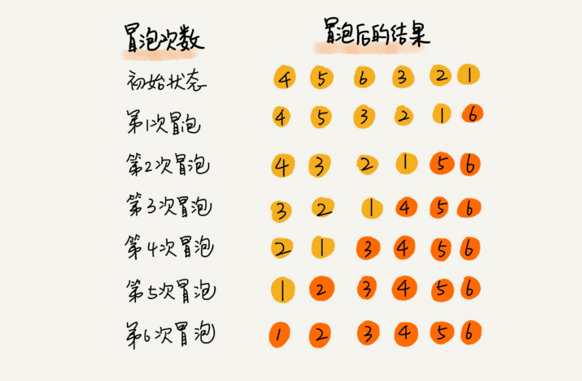

## 冒泡排序

#### 思想

冒泡排序只会操作相邻的两个数据。每次冒泡操作都会对相邻的两个元素进行比较，看是否满足大小关系要求。如果不满足就让它俩互换。一次冒泡会让至少一个元素移动到它应该在的位置，重复 n 次，就完成了 n 个数据的排序工作。



冒泡排序是一个原地、稳定的排序算法，最好情况时间复杂度是 O(n)，最坏情况时间复杂度为 O(n ^ 2)，平均情况下的时间复杂度就是 O(n ^ 2)


#### 参考代码

```python
from typing import List

def bubble_sort(arr: List[int]):
    if not arr or len(arr) <=1:
        return arr
        
    length = len(arr)
    for i in range(length):
        for j in range(length - i - 1):
            if arr[j] > arr[j + 1]:
                arr[j], arr[j + 1] = arr[j + 1], arr[j]
    return arr


if __name__ == "__main__":
    array = [5, 6, -1, 4, 2, 8, 10, 7, 6]
    bubble_sort(array)
    print(array)
```

