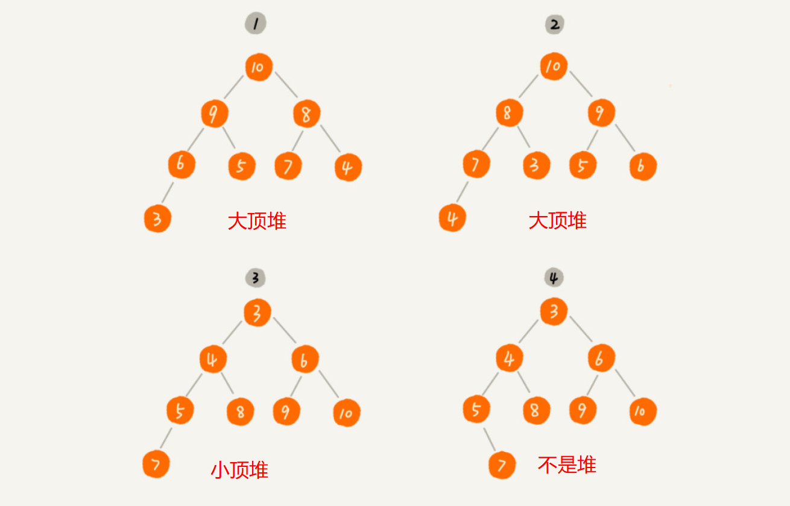

## 堆

#### 如何理解“堆”？

需要满足两点要求：

- 堆是一个完全二叉树；
- 堆中每一个节点的值都必须大于等于（或小于等于）其子树中每个节点的值




#### 如何实现一个堆？

用**数组**来存储完全二叉树是非常节省存储空间的。

堆的核心操作：

1. 往堆中插入一个元素：（堆化）把新插入的元素放到堆的最后，进行调整，让其重新满足堆的特性。
2. 删除堆顶元素：


一个包含 n 个节点的完全二叉树，树的高度不会超过 log2n。堆化的过程是顺着节点所在路径比较交换的，所以堆化的时间复杂度跟树的高度成正比，也就是 O(logn)，插入数据和删除堆顶元素的主要逻辑就是堆化，所以，往堆中插入一个元素和删除堆顶元素的时间复杂度都是 O(logn)。


堆代码

```python
#!/usr/bin/python
# -*- coding: UTF-8 -*-

import math
import random


class BinaryHeap:
    """
    大顶堆
    """

    def __init__(self, data=None, capacity=100):
        self._data = []
        self._capacity = capacity
        if type(data) is list:
            if len(data) > self._capacity:
                raise Exception('Heap oversize, capacity:{}, data size:{}'.format(
                    self._capacity, len(data)))
            self._type_assert(data)
            self._data = data

        self._length = len(self._data)

    def heapify(self):
        """
        堆化
        :return:
        """
        self._heapify(self._data, self._length-1)

    def _heapify(self, data, tail_idx):
        """
        堆化内部实现
        :param data: 需要堆化的数据
        :param tail_idx: 尾元素的索引
        :return:
        """
        # heapify data[:tail_idx+1]
        if tail_idx <= 0:
            return

        # idx of the Last Parent node
        lp = (tail_idx - 1) // 2

        for i in range(lp, -1, -1):
            self._heap_down(data, i, tail_idx)

    @staticmethod
    def _heap_down(data, idx, tail_idx):
        """
        将指定的位置堆化
        :param data: 需要堆化的数据
        :param idx: data: 中需要堆化的位置
        :param tail_idx: 尾元素的索引
        :return:
        """
        assert type(data) is list

        lp = (tail_idx - 1) // 2
        # top-down
        while idx <= lp:
            # Left and Right Child index
            lc = 2 * idx + 1
            rc = lc + 1

            # right child exists
            if rc <= tail_idx:
                tmp = lc if data[lc] > data[rc] else rc
            else:
                tmp = lc

            if data[tmp] > data[idx]:
                data[tmp], data[idx] = data[idx], data[tmp]
                idx = tmp
            else:
                break

    def insert(self, num):
        """
        插入
        :param num:
        :return:
        """
        if self._length < self._capacity:
            if self._insert(self._data, num):
                self._length += 1
                return True
        return False

    @staticmethod
    def _insert(data, num):
        """
        堆中插入元素的内部实现
        :param data:
        :param num:
        :return:
        """
        assert type(data) is list
        assert type(num) is int

        data.append(num)
        length = len(data)

        # idx of New Node
        nn = length - 1
        # bottom-up
        while nn > 0:
            p = (nn-1) // 2
            if data[nn] > data[p]:
                data[nn], data[p] = data[p], data[nn]
                nn = p
            else:
                break

        return True

    def get_top(self):
        """
        取堆顶
        :return:
        """
        if self._length <= 0:
            return None
        return self._data[0]

    def remove_top(self):
        """
        取堆顶
        :return:
        """
        ret = None
        if self._length > 0:
            ret = self._remove_top(self._data)
            self._length -= 1
        return ret

    @staticmethod
    def _remove_top(data):
        """
        取堆顶内部实现
        :param data:
        :return:
        """
        assert type(data) is list

        length = len(data)
        if length == 0:
            return None

        data[0], data[-1] = data[-1], data[0]
        ret = data.pop()
        length -= 1

        # length == 0 or == 1, return
        if length > 1:
            BinaryHeap._heap_down(data, 0, length-1)

        return ret

    @staticmethod
    def _type_assert(nums):
        assert type(nums) is list
        for n in nums:
            assert type(n) is int

    @staticmethod
    def _draw_heap(data):
        """
        格式化打印
        :param data:
        :return:
        """
        length = len(data)

        if length == 0:
            return 'empty heap'

        ret = ''
        for i, n in enumerate(data):
            ret += str(n)
            # 每行最后一个换行
            if i == 2**int(math.log(i+1, 2)+1) - 2 or i == len(data) - 1:
                ret += '\n'
            else:
                ret += ', '

        return ret

    def __repr__(self):
        return self._draw_heap(self._data)


if __name__ == '__main__':
    nums = list(range(10))
    random.shuffle(nums)

    bh = BinaryHeap(nums)
    print('--- before heapify ---')
    print(bh)

    # heapify
    bh.heapify()
    print('--- after heapify ---')
    print(bh)

    # insert
    print('--- insert ---')
    if bh.insert(8):
        print('insert success')
    else:
        print('insert fail')
    print(bh)

    # get top
    print('--- get top ---')
    print('get top of the heap: {}'.format(bh.get_top()))
    bh.remove_top()
    print(bh)
```


#### 如何基于堆实现排序？

借助于堆这种数据结构实现的排序算法，就叫作堆排序。堆排序的时间复杂度非常稳定，是  O(n logn)，并且它还是原地排序算法。


堆排序的过程大致分解成两个大的步骤，建堆和排序。


堆排序代码

```python
#!/usr/bin/python
# -*- coding: UTF-8 -*-

from binary_heap import BinaryHeap


class BinaryHeapSort(BinaryHeap):
    def __init__(self):
        super(BinaryHeapSort, self).__init__()

    def sort(self, nums):
        """
        排序
        1. 堆化，大顶堆
        2. 排序，从后往前遍历，首尾元素互换，子数组堆化
        :param nums:
        :return:
        """
        assert type(nums) is list
        length = len(nums)

        if length <= 1:
            return

        self._type_assert(nums)

        # heapify
        self._heapify(nums, length-1)

        # sort
        for i in range(length-1, 0, -1):
            nums[0], nums[i] = nums[i], nums[0]
            self._heap_down(nums, 0, i-1)

        return


if __name__ == '__main__':
    bhs = BinaryHeapSort()
    nums = [3, 5, 2, 6, 1, 7, 6]

    print('--- before sort ---')
    print(nums)

    bhs.sort(nums)
    print('--- after sort ---')
    print(nums)
```


**在实际开发中，为什么快速排序要比堆排序性能好？**

第一点，堆排序数据访问的方式没有快速排序友好。（数据是跳着访问的，局部顺序访问时对 CPU 缓存不友好）

第二点，对于同样的数据，在排序过程中，堆排序算法的数据交换次数要多于快速排序。

