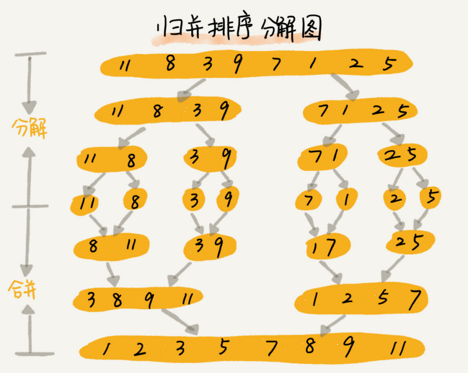

## 归并排序

#### 基本原理

如果要排序一个数组，我们先把数组从中间分成前后两部分，然后对前后两部分分别排序，再将排好序的两部分合并在一起，这样整个数组就都有序了。



归并排序使用的是分治思想，分治是一种解决问题的处理思想，递归是一种编程技巧。

归并排序的时间复杂度任何情况下都是 O(nlogn)，归并排序**不是原地排序**算法，空间复杂度是 O(n)，而归并排序稳不稳定关键要看merge() 函数。


#### 参考代码

```python
from typing import List

def merge_sort(arr: List[int]):
    _merge_sort_between(arr, 0, len(arr) - 1)

def _merge_sort_between(arr: List[int], low: int, high: int):
    if low < high:
        mid = low + (high - low) // 2
        _merge_sort_between(arr, low, mid)
        _merge_sort_between(arr, mid + 1, high)
        _merge(arr, low, mid, high)

def _merge(arr: List[int], low: int, mid: int, high: int):
    i, j = low, mid + 1
    temp = []
    while i <= mid and j <= high:
        if arr[i] <= arr[j]:
            temp.append(arr[i])
            i += 1
        else:
            temp.append(arr[j])
            j += 1
    start = i if i <= mid else j
    end = mid if i <= mid else high
    temp.extend(arr[start: end + 1])
    arr[low: high + 1] = temp

if __name__ == "__main__":
    lis = [5, -1, 9, 3, 7, 8, 3, -2, 9]
    merge_sort(lis)
    print(lis)
```

