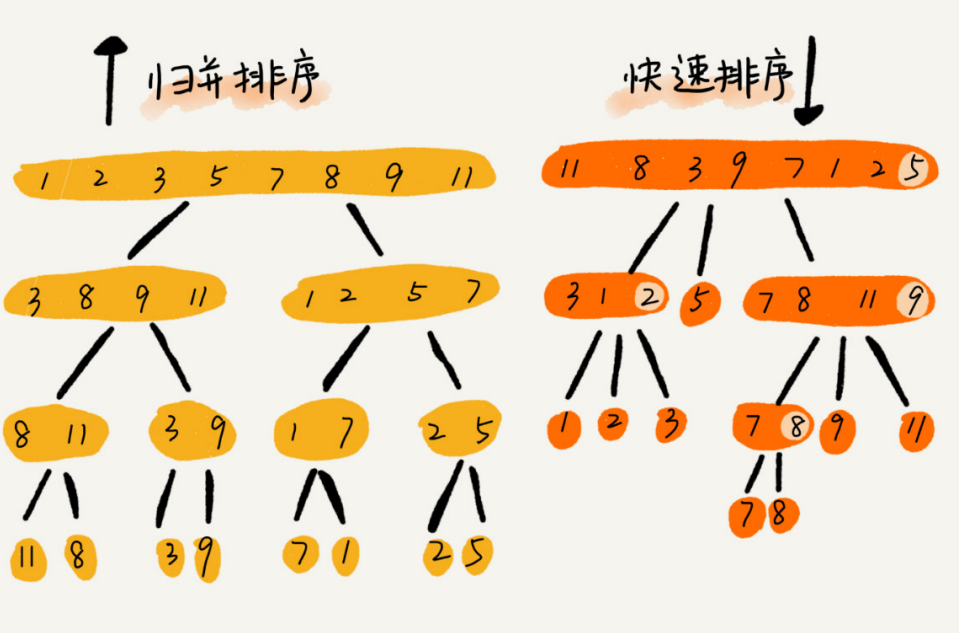

## 快速排序

#### 基本思想

如果要排序数组中下标从 p 到 r 之间的一组数据，我们选择 p 到 r之间的任意一个数据作为 pivot（分区点），我们遍历 p 到 r 之间的数据，将小于 pivot 的放到左边，将大于 pivot 的放到右边，将pivot 放到中间。经过这一步骤之后，数组 p 到 r 之间的数据就被分成了三个部分，前面p 到 q-1 之间都是小于 pivot 的，中间是 pivot，后面的 q+1 到 r 之间是大于 pivot 的。


根据分治、递归的处理思想，我们可以用递归排序下标从 p 到 q-1 之间的数据和下标从q+1 到 r 之间的数据，直到区间缩小为 1，就说明所有的数据都有序了。

快速排序算法最坏情况下的时间复杂度是 O(n ^ 2)，但是**平均情况下时间复杂度都是O(nlogn)**。不仅如此，快速排序算法时间复杂度退化到 O(n ^ 2) 的概率非常小，我们可以通过合理地选择 pivot 来避免这种情况。


归并排序与快速排序



归并排序的处理过程是由下到上的，先处理子问题，然后再合并。而快排正好相反，它的处理过程是由上到下的，先分区，然后再处理子问题。

归并排序虽然是稳定的、时间复杂度为 O(nlogn) 的排序算法，但是它是非原地排序算法。快速排序通过设计巧妙的原地分区函数，可以实现原地排序，解决了归并排序占用太多内存的问题。


#### 参考代码

```python
from typing import List
import random

def quick_sort(arr: List[int]):
    _quick_sort_between(arr, 0, len(arr) - 1)

def _quick_sort_between(arr: List[int], low: int, high: int):
    if low < high:
        k = random.randint(low, high)
        arr[low], arr[k] = arr[k], arr[low]

        m = _partition(arr, low, high)
        _quick_sort_between(arr, low, m - 1)
        _quick_sort_between(arr, m + 1, high)

def _partition(arr: List[int], low: int, high: int):
    pivot, j = arr[low], low
    for i in range(low + 1, high + 1):
        if arr[i] <= pivot:
            j += 1
            arr[j], arr[i] = arr[i], arr[j]
    arr[low], arr[j] = arr[j], arr[low]
    return j

if __name__ == "__main__":
    lis = [5, -1, 9, 3, 7, 8, 3, -2, 9]
    quick_sort(lis)
    print(lis)
```

