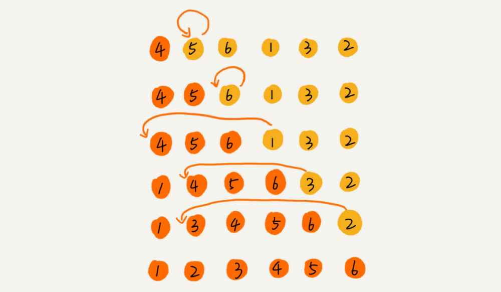

## 插入排序

#### 思想

首先，我们将数组中的数据分为两个区间，**已排序区间**和**未排序区间**。初始已排序区间只有一个元素，就是数组的第一个元素。插入算法的**核心思想**是取未排序区间中的元素，在已排序区间中找到合适的插入位置将其插入，并保证已排序区间数据一直有序。重复这个过程，直到未排序区间中元素为空，算法结束。



插入排序是一个原地、稳定的排序算法，最好是时间复杂度为 O(n)，最坏情况时间复杂度为 O(n ^ 2)，平均时间复杂度为 O(n ^ 2)。


#### 参考代码

```python
from typing import List

def insertion_sort(arr: List[int]):
    if not arr or len(arr) <= 1:
        return arr
        
    length = len(arr)
    for i in range(1, length):
        j, temp = i, arr[i]
        while j > 0 and temp < arr[j - 1]:
            arr[j] = arr[j - 1]
            j -= 1
        arr[j] = temp
    return arr

if __name__ == "__main__":
    array = [5, 6, -1, 4, 2, 8, 10, 7, 6]
    insertion_sort(array)
    print(array)
```

