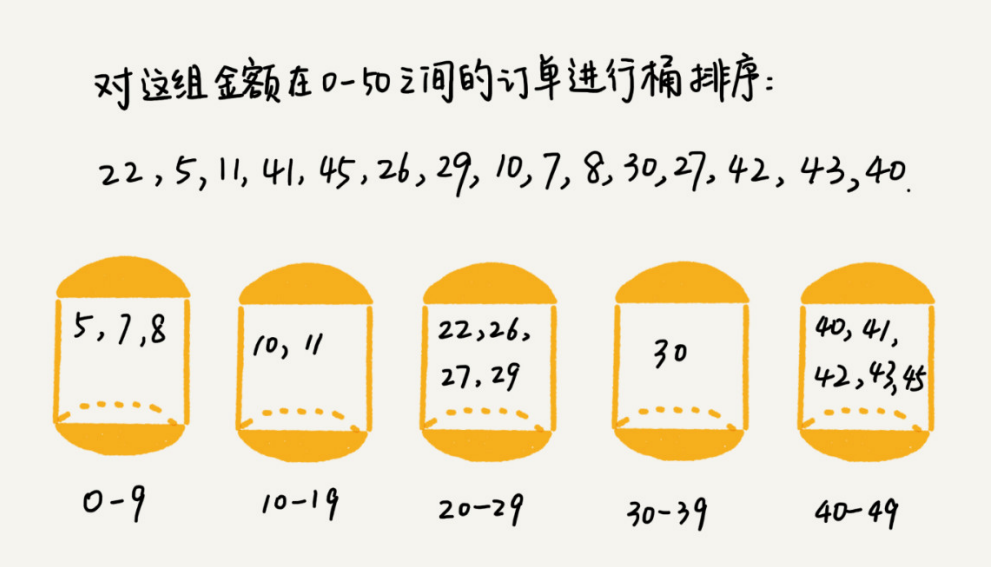
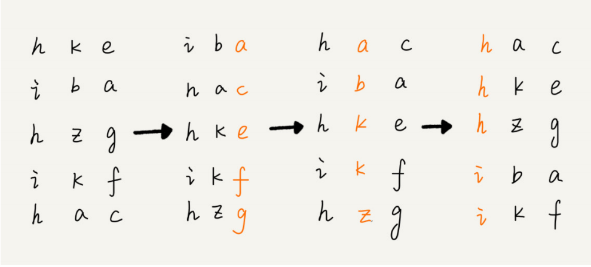

## 线性排序

最常见的线性排序算法主要有三种：桶排序、计数排序、基数排序，时间复杂度都是 O(n) ，它们之所以能做到线性的时间复杂度，主要原因是，这三个算法是**非基于比较**的排序算法，都不涉及元素之间的比较操作。


####  桶排序

核心思想是将要排序的数据分到几个有序的桶里，每个桶里的数据再单独进行排序。桶内排完序之后，再把每个桶里的数据按照顺序依次取出，组成的序列就是有序的了。



桶排序比较适合用在外部排序中。所谓的外部排序就是数据存储在外部磁盘中，数据量比较大，内存有限，无法将数据全部加载到内存中。可以对数据进行分桶，每一个桶对应一个文件，然后依次把每个文件加载到内存中，使用快速排序进行排序，等所有文件都排完序，再依次读取文件即可得到结果。


#### 计数排序

计数排序其实是桶排序的一种特殊情况。当要排序的 n 个数据，所处的**范围并不大**的时候，比如最大值是 k，我们就可以把数据划分成 k 个桶，**每个桶内的数据值都是相同的**，省掉了桶内排序的时间。


##### 计数排序参考代码

```python
from typing import List
import itertools

def counting_sort(arr: List[int]):
        if len(arr) <= 1:
                return
        # arr中有counts[i]个数不大于1
        counts = [0] * (max(arr) + 1)
        for n in arr:
            	# 计数
                counts[n] += 1
        counts = list(itertools.accumulate(counts))

        # 临时数组，存储排序之后的结果
        arr_sorted = [0] * len(arr)
        for n in reversed(arr):
                index = counts[n] - 1
                arr_sorted[index] = n
                counts[n] -= 1
        
        arr[:] = arr_sorted

if __name__ == "__main__":
        lis = [4, 5, 0, 9, 3, 3, 1, 9, 8, 7]
        counting_sort(lis)
        print(lis)
        
```


#### 基数排序

假设我们有 10 万个手机号码，希望将这 10 万个手机号码从小到大排序，你有什么比较快速的排序方法呢？

发现规律：假设要比较两个手机号码 a，b 的大小，如果在前面几位中，a 手机号码已经比 b 手机号码大了，那后面的几位就不用看了。

使用基数排序，先按照最后一位来排序手机号码，然后，再按照倒数第二位重新排序，以此类推，最后按照第一位重新排序。经过 11 次排序之后，手机号码就都有序了。




