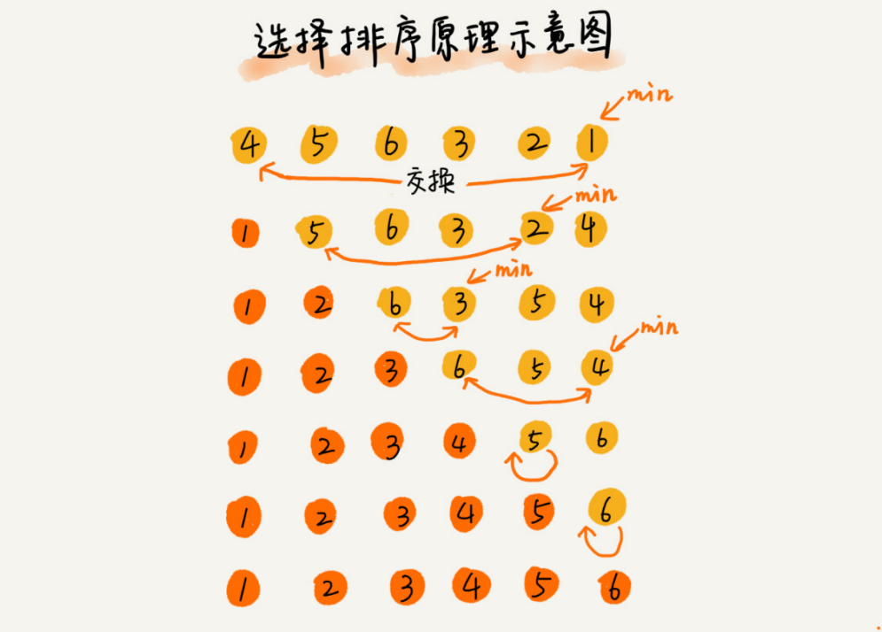

## 选择排序

#### 思想

选择排序算法的实现思路有点类似插入排序，也分已排序区间和未排序区间。但是选择排序每次会从未排序区间中找到最小的元素，将其放到已排序区间的末尾。



选择排序是一种原地、**不稳定**排序算法，最好情况时间复杂度、最坏情况和平均情况时间复杂度都为 O(n ^ 2)。


#### 参考代码

```python
from typing import List

def selection_sort(arr: List[int]):
    if not arr or len(arr) <= 1:
        return arr
    
    length = len(arr)
    for i in range(length):
        minIndex = i
        for j in range(i + 1, length):
            if arr[minIndex] > arr[j]:
                minIndex = j
        arr[i], arr[minIndex] = arr[minIndex], arr[i]
    return arr

if __name__ == "__main__":
    array = [5, 6, -1, 4, 2, 8, 10, 7, 6]
    selection_sort(array)
    print(array)
```

