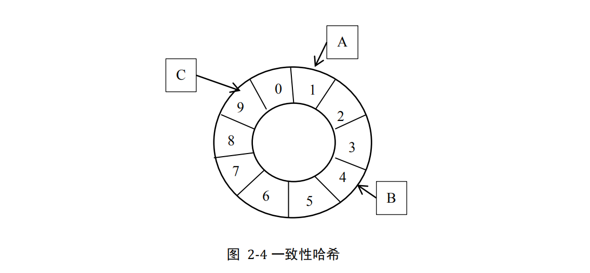

## 哈希算法

**什么是哈希算法？**

将任意长度的二进制值串映射为**固定长度**的二进制值串，**这个映射的规则就是哈希算法**，而通过原始数据映射之后得到的二进制值串就是哈希值。

**满足的几点要求：**

- 从哈希值不能反向推导出原始数据（所以哈希算法也叫单向哈希算法）；
- 对输入数据非常敏感，哪怕原始数据只修改了一个 Bit，最后得到的哈希值也大不相同；
- 散列冲突的概率要很小，对于不同的原始数据，哈希值相同的概率非常小；
- 哈希算法的执行效率要尽量高效，针对较长的文本，也能快速地计算出哈希值。

#### 哈希算法的应用

##### 应用一：安全加密

- MD5（MD5 Message-Digest Algorithm，MD5 消息摘要算法）

- SHA（Secure Hash Algorithm，安全散列算法）
- DES（Data Encryption Standard，数据加密标准）
- AES（Advanced Encryption Standard，高级加密标准）

##### 应用二：唯一标识

举例：如何在海量的图库中，搜索一张图是否存在？

可以从图片的二进制码串开头取 100 个字节，从中间取 100 个字节，从最后再取 100 个字节，然后将这300 个字节放到一块，通过哈希算法（比如 MD5），得到一个哈希字符串，用它作为图片的唯一标识。通过这个唯一标识来判定图片是否在图库中，这样就可以减少很多工作量。

##### 应用三：数据校验

举例：在网络文件传输中，如何来校验文件块的安全、正确、完整呢？

大文件的传输一般会被分割成很多文件块，等所有的文件块都下载完成之后，再组装成一个完整的文件。

通过哈希算法，对 文件块分别取哈希值，并且保存在种子文件中。当文件块下载完成之后，我们可以通过相同的哈希算法，对下载好的文件块逐一求哈希值，然后跟种子文件中保存的哈希值比对。如果不同，说明这个文件块不完整或者被篡改了，需要再重新从其他宿主机器上下载这个文件块。

##### 应用四：散列函数

散列函数用的散列算法一般都比较简单，看重的是散列的平均性和哈希算法的执行效率。

##### 应用五：负载均衡

举例：负载均衡算法有很多，比如轮询、随机、加权轮询等。那如何才能实现一个会话粘滞（session sticky）的负载均衡算法呢？也就是说，我们需要在同一个客户端上，在一次会话中的所有请求都路由到同一个服务器上。

可以通过哈希算法，对客户端IP 地址或者会话 ID 计算哈希值，将取得的哈希值与服务器列表的大小进行取模运算，最终得到的值就是应该被路由到的服务器编号。 这样，我们就可以把同一个 IP 过来的所有请求，都路由到同一个后端服务器上。

##### 应用六：数据分片

举例：记录用户的搜索关键字的日志文件已经非常多且非常大，该如何快速统计出每个关键词被搜索的次数，该怎么做呢？

两个难点，第一个是搜索日志很大，没办法放到一台机器的内存中。第二个难点是，如果只用一台机器来处理这么巨大的数据，处理时间会很长。

为了提高处理的速度，我们用 n 台机器并行处理。我们从搜索记录的日志文件中，依次读出每个搜索关键词，并且通过哈希函数计算哈希值，然后再跟 n 取模，最终得到的值，就是应该被分配到的机器编号。同一个搜索关键
词会被分配到同一个机器上。每个机器会分别计算关键词出现的次数，最后合并起来就是最终的结果。

实际上，这里的处理过程也是 MapReduce 的基本设计思想。

##### 应用七：分布式存储

在海量数据的存储中，需要将数据分发到多台机器上存储，可以借用前面数据分片的思想，即通过哈
希算法对数据取哈希值，然后对机器个数取模，这个最终值就是应该存储的机器编号。

但是机器的数量一般不是固定的，机器可能会宕机，也可能新增机器，当机器数量变化时如果将所有数据都重新hash，可能会发生雪崩效应。这时就需要**一致性哈希算法**了，它使得在新加入一个机器后，并不需要做大量的数据搬移。

假设我们有 k 个机器，数据的哈希值的范围是 [0, MAX]。我们将整个范围划分成 m 个小区间（m 远大于 k），每个机器负责 m/k 个小区间。当有新机器加入的时候，我们就将某几个小区间的数据，从原来的机器中搬移到新的机器中。这样，既不用全部重新哈希、搬移数据，也保持了各个机器上数据数量的均衡。

