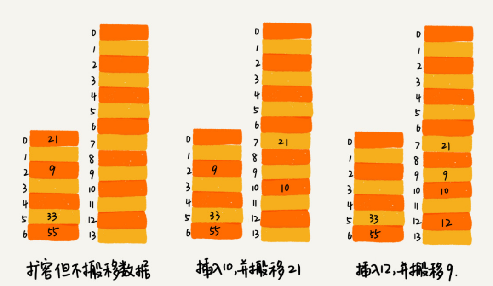
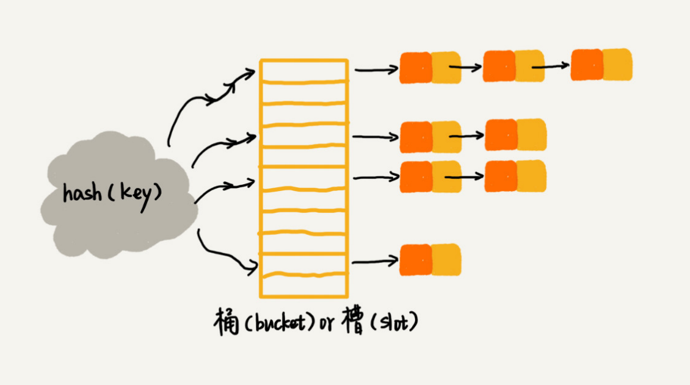

## 散列表

#### 介绍

散列表也叫**哈希表**。散列表利用的是**数组**支持**按照下标随机访问数据**的特性，时间复杂度是 O(1) 。通过散列函数把元素的**键值**映射为下标，然后将数据存储在数组中对应下标的位置，当我们按照键值查询元素时，我们用同样的**散列函数**，将键值转化数组下标，从对应的数组下标的位置取数据。

散列表两个核心问题是散列函数设计和散列冲突解决。


#### 散列函数设计

**散列函数**，可以把它定义成hash(key)，其中 key 表示元素的键值，hash(key) 的值表示经过散列函数计算得到的散列值。散列函数在散列表中起着非常关键的作用。

散列函数的设计不能太复杂，生成的值要尽可能随机并且均匀分布，那么该如何构造散列函数？以下三点散列函数设计的基本要求：

- 散列函数计算得到的散列值是一个非负整数；
- 如果 key1 = key2，那 hash(key1) == hash(key2)；
- 如果 key1 ≠ key2，那 hash(key1) ≠ hash(key2)。

实际工作中，我们还需要综合考虑各种因素。这些因素有关键字的长度、特点、分布、还有散列表的大小等。

在真实的情况下，要想找到一个不同的 key 对应的散列值都不一样的散列函数，几乎是不可能的。当不同的key对应到相同的散列值时，就会产生**散列冲突**。

当散列表中空闲位置不多的时候，散列冲突的概率就会大大提高。为了尽可能保证散列表的操作效率，一般情况下，我们会尽可能保证散列表中有一定比例的空闲槽位。我们用**装载因子**（load factor）来表示空位的多少，装载因子的计算公式是：

```
散列表的装载因子 = 填入表中的元素个数 / 散列表的长度
```

装载因子越大，说明空闲位置越少，冲突越多，散列表的性能会下降。


#### 动态扩容

对于动态散列表来说，随着数据慢慢加入，装载因子就会慢慢变大。当装载因子大到一定程度之后，散列冲突就会变得不可接受，这个时候就需要考虑“**动态扩容**”了。可以设置当散列表的装载因子超过某个**阈值**时，就重新申请一个更大的散列表，将数据搬移到这个新散列表中。装载因子阈值的设置要权衡时间、空间复杂度。


**如何避免低效的扩容？**

当散列表比较大时，一次性扩容需要耗费较多时间，为了解决一次性扩容耗时过多的情况，我们可以将扩容操作穿插在插入操作的过程中，**分批完成**。当装载因子触达阈值之后，我们**只申请新空间，但并不将老的数据搬移到新散列表**中。

当有新数据要插入时，我们**将新数据插入新散列表中，并且从老的散列表中拿出一个数据放入到新散列表**。每次插入一个数据到散列表，我们都重复上面的过程。经过多次插入操作之后，老的散列表中的数据就一点一点全部搬移到新散列表中了。这样没有了集中的一次性数据搬移，插入操作就都变得很快了。



这期间的查询操作怎么来做呢？对于查询操作，为了兼容了新、老散列表中的数据，我们先从新散列表中查找，如果没有找到，再去老的散列表中查找。


#### 散列冲突解决

常用的散列冲突解决方法有两类，**开放寻址法**（open addressing）和**链表法**（chaining）


开放寻址法的核心思想是，如果出现了散列冲突，我们就重新探测一个空闲位置，将其插入。探测方法常见的有下面三种：

- **线性探测**（Linear Probing）：当我们往散列表中插入数据时，如果某个数据经过散列函数散列之后，存储位置已经被占用了，我们就从当前位置开始，依次往后查找，看是否有空闲位置，直到找到为止。
- **二次探测**（Quadratic probing）：它探测的下标序列就是 hash(key)+0，hash(key)+1 ，hash(key)+2 ……
- **双重散列**（Double hashing）：意思就是不仅要使用一个散列函数。我们使用一组散列函数hash1(key)，hash2(key)，hash3(key)……


链表法是一种**更加常用**的散列冲突解决办法，相比开放寻址法，它要简单很多。我们来看这个图，在散列表中，每个“桶（bucket）”或者“槽（slot）”会对应一条链表，所有散列值相同的元素我们都放到相同槽位对应的链表中。



链表法插入的时间复杂度是 O(1)，查找或删除操作的时间复杂度是O(k)，k=n/m，其中 n 表示散列中数据的个数，m 表示散列表中“槽”的个数。


#### 对比与选择

关于开放寻址法：

- 开放寻址法不像链表法，需要拉很多链表。散列表中的数据都存储在数组中，可以有效地利用 CPU 缓存加快查询速度。而且，这种方法实现的散列表，序列化起来比较简单。链表法包含指针，序列化起来就没那么容易。
- 但是用开放寻址法解决冲突的散列表，删除数据的时候比较麻烦，需要特殊标记已经删除掉的数据。而且，在开放寻址法中，所有的数据都存储在一个数组中，比起链表法来说，冲突的代价更高。所以，使用开放寻址法解决冲突的散列表，装载因子的上限不能太大。这也导致这种方法比链表法更浪费内存空间。
- 当数据量比较小、装载因子小的时候，适合采用开放寻址法。这也是Java 中的ThreadLocalMap使用开放寻址法解决散列冲突的原因。


关于链表法：

- 链表法对内存的利用率比开放寻址法要高。因为链表结点可以在需要的时候再创建，并不需要像开放寻址法那样事先申请好。
- 链表法比起开放寻址法，对大装载因子的容忍度更高。对于链表法来说，只要散列函数的值随机均匀，即便装载因子变成 10，也就是链表的长度变长了而已，虽然查找效率有所下降，但是比起顺序查找还是快很多。
- 链表因为要存储指针，所以对于比较小的对象的存储，是比较消耗内存的，还有可能会让内存的消耗翻倍。而且，因为链表中的结点是零散分布在内存中的，不是连续的，所以对 CPU 缓存是不友好的，这方面对于执行效率也有一定的影响
- 我们对链表法稍加改造，可以实现一个更加高效的散列表。那就是，我们将链表法中的链表改造为其他高效的动态数据结构，比如跳表、红黑树。
- 基于链表的散列冲突处理方法比较适合存储大对象、大数据量的散列表，而且，比起开放寻址法，它更加灵活，支持更多的优化策略，比如用红黑树代替链表。


#### 工业级散列表举例分析

**何为一个工业级的散列表？工业级的散列表应该具有哪些特性？**

- 支持快速的查询、插入、删除操作；
- 内存占用合理，不能浪费过多的内存空间；
- 性能稳定，极端情况下，散列表的性能也不会退化到无法接受的情况。

**如何实现这样一个散列表呢？**

- 设计一个合适的散列函数；
- 定义装载因子阈值，并且设计动态扩容策略；
- 选择合适的散列冲突解决方法。


##### Java 中的 HashMap

1. **初始大小**：HashMap 默认的初始大小是 16
2. **装载因子和动态扩容**：最大装载因子默认是 **0.75**，当 HashMap 中元素个数超过 0.75*capacity（capacity 表示散列表的容量）的时候，就会启动扩容，每次扩容都会扩容为原来的**两倍**大小。
3. **散列冲突解决方法**：HashMap 底层采用链表法来解决冲突，**在 JDK1.8 版本中**，为了对 HashMap 做进一步优化，我们引入了红黑树。而当链表长度太长（默认**超过 8**）时，**链表就转换为红黑树**。我们可以利用红黑树快速增删改查的特点，提高 HashMap 的性能。当红黑树结点个数少于 8 个的时候，又会将红黑树转化为链表。因为在数据量较小的情况下，红黑树要维护平衡，比起链表来，性能上的优势并不明显。
4. **散列函数**：

```java
int hash(Object key) {
    int h = key.hashCode()；
    return (h ^ (h >>> 16)) & (capitity -1); //capicity 表示散列表的大小
}
```


##### Java 中的 HashTable

1. **默认初始大小**：11

2. **装载因子**：0.75

3. **散列函数**：

```java
int hash = key.hashCode();
int index = (hash & 0x7FFFFFFF) % tab.length;
```

4. 当装载因子大于**0.75**时，启动扩容机制

5. 冲突解决方法：使用**单链表**解决hash冲突


##### Java 中的 ThreadLocalMap

1. **初始容量**：16

2. **装载因子**：2/3

3. **散列函数**：

```java
hash(Object key) {
    int HASH_INCREMENT = 0x61c88647;
    AtomicInteger nextHashCode = new AtomicInteger();
    nextHashCode.getAndAdd(HASH_INCREMENT)
    int threadLocalHashCode = nextHashCode()
    int i = threadLocalHashCode & (table.length - 1);
}
```

4. 当装载因子大于 **2/3** 时，启动扩容机制

5. 使用**线性探测的开放地址法**解决hash冲突


##### Java 中的  LinkedHashMap

HashMap 底层是通过散列表这种数据结构实现的。而 LinkedHashMap 前面比 HashMap 多了一个“Linked”，其中的“Linked”并不仅仅代表它是通过链表法解决散列冲突的。

实际上，按照访问时间排序的 LinkedHashMap 本身就是一个支持 LRU 缓存淘汰策略的缓存系统，它们两个的实现原理也是一模一样的。