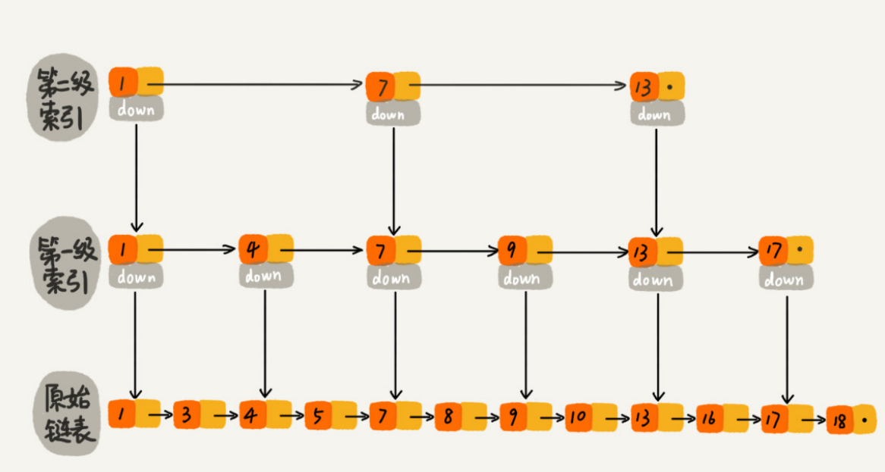
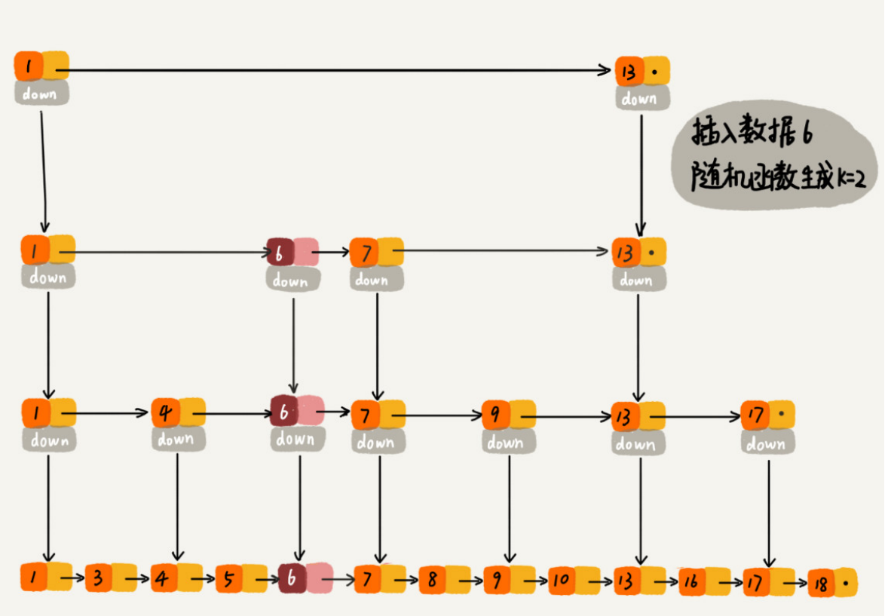

## 跳表

#### 介绍

跳表使用空间换时间的设计思路，通过**构建多级索引**来提高查询的效率，实现了**基于有序链表的“二分查找”**。跳表是一种动态数据结构，支持快速的插入、删除、查找操作，时间复杂度都是 O(logn)，空间复杂度是 O(n)。




**删除操作**：

单链表中的删除操作需要拿到要删除结点的前驱结点，然后通过指针操作完成删除。如果这个结点在索引中也有出现，我们除了要删除原始链表中的结点，还要删除索引中的。

**插入操作并动态更新索引：**

当往跳表中插入数据的时候，可以选择同时将这个数据插入到部分索引层中。跳表通过一个**随机函数**，来决定将这个结点插入到哪几级索引中，比如随机函数生成了值K，那我们就将这个结点添加到第一级到第 K 级这 K 级索引中。跳表是通过随机函数来维护“**平衡性**”。




#### 为什么 Redis 要用跳表来实现有序集合，而不是红黑树？

（严格的说还有散列表）Redis 的有序集合支持的核心操作主要有：

- 插入一个数据
- 删除一个数据
- 查找一个数据
- 按照区间查找数据
- 迭代输出有序序列

其中，插入、删除、查找以及迭代输出有序序列这几个操作，红黑树也可以完成，时间复杂度跟跳表是一样的。但是，**按照区间来查找数据这个操作，红黑树的效率没有跳表高**。对于按照区间查找数据这个操作，跳表可以做到 O(logn) 的时间复杂度定位区间的起点，然后在原始链表中顺序往后遍历就可以了。这样做非常高效。

而且相比红黑树，跳表相对好懂、好写、更加灵活，它可以通过改变索引构建策略，有效平衡执行效率和内存消耗。


#### 参考代码

代码中跳表的数据结构


- 结点3、7、12、19、21都只有一层，没有索引，与普通的单链表差不多
- 结点9、17有两层，上面一层是索引
- 结点25有三层，上面的两层是索引
- 结点6有四层，上面三层是索引


下图是一个简单的跳表，最大层数只有两层，一级索引，绿色的线是跳表搜索结点19的**搜索路径**


一个简单的跳表实现代码如下，可配合这篇文章《[跳表──没听过但很犀利的数据结构](https://lotabout.me/2018/skip-list/)》。

代码的**要点**：

- 结点内的forwards数组，用于存储该结点所有层的下一个结点的信息，forwards[ 0 ]对应的是当前结点**在原始链表**里的下一跳，forwards[ 1 ]是当前结点的**第一级索引**的下一跳，同理，forwards[ n ]是当前结点的**第n级索引**的下一跳。
- head是一个头结点（哨兵，不存储实际数据），它的forwards里存的是原始链表以及索引层的头结点。
- 每次插入数据的时候，随机产生的 level 决定了新节点的层数，用于维护跳表的“平衡性”。
- 数组update的作用：用以存储新节点所有层数上，各自的前一个节点的信息。
- 当所有结点的 _level_count 都为 1 的时候，跳表退化成一个普通链表。

```python
from typing import Optional
import random


class ListNode:

    def __init__(self, data: Optional[int] = None):
        self._data = data
        self._forwards = []   # Forward pointers


class SkipList:
    """
    跳表的一种实现方法。
    跳表中储存的是正整数，并且储存的是不重复的。
    """

    _MAX_LEVEL = 16

    def __init__(self):
        self._level_count = 1
        self._head = ListNode()
        self._head._forwards = [None] * type(self)._MAX_LEVEL

    def find(self, value: int) -> Optional[ListNode]:
        p = self._head
        for i in range(self._level_count - 1, -1, -1):   # Move down a level
            while p._forwards[i] and p._forwards[i]._data < value:
                p = p._forwards[i]   # Move along level

        return p._forwards[0] if p._forwards[0] and p._forwards[0]._data == value else None

    def insert(self, value: int):
        level = self._random_level()
        if self._level_count < level:
            self._level_count = level
        new_node = ListNode(value)
        new_node._forwards = [None] * level
        update = [self._head] * level     # update is like a list of prevs

        p = self._head
        for i in range(level - 1, -1, -1):
            while p._forwards[i] and p._forwards[i]._data < value:
                p = p._forwards[i]

            update[i] = p     # Found a prev

        for i in range(level):
            # new_node.next = prev.next
            new_node._forwards[i] = update[i]._forwards[i]
            update[i]._forwards[i] = new_node     # prev.next = new_node

    def delete(self, value):
        update = [None] * self._level_count
        p = self._head
        for i in range(self._level_count - 1, -1, -1):
            while p._forwards[i] and p._forwards[i]._data < value:
                p = p._forwards[i]
            update[i] = p

        if p._forwards[0] and p._forwards[0]._data == value:
            for i in range(self._level_count - 1, -1, -1):
                if update[i]._forwards[i] and update[i]._forwards[i]._data == value:
                    # Similar to prev.next = prev.next.next
                    update[i]._forwards[i] = update[i]._forwards[i]._forwards[i]

    def _random_level(self, p: float = 0.5) -> int:
        level = 1
        while random.random() < p and level < type(self)._MAX_LEVEL:
            level += 1
        return level

    def __repr__(self) -> str:
        values = []
        p = self._head
        while p._forwards[0]:
            values.append(str(p._forwards[0]._data))
            p = p._forwards[0]
        return "->".join(values)


if __name__ == "__main__":
    skipList = SkipList()
    for i in range(10):
        skipList.insert(i)
    print(skipList)
    p = skipList.find(7)
    print(p._data)
    skipList.delete(3)
    print(skipList)
```

控制台输出

```
0->1->2->3->4->5->6->7->8->9
7
0->1->2->4->5->6->7->8->9
```

