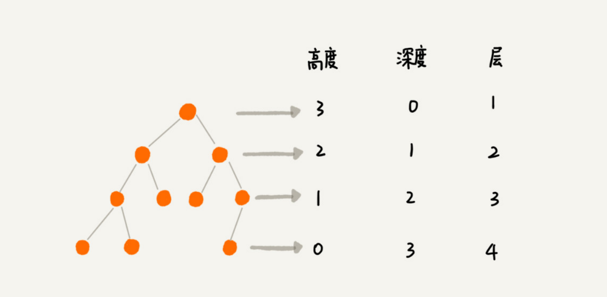
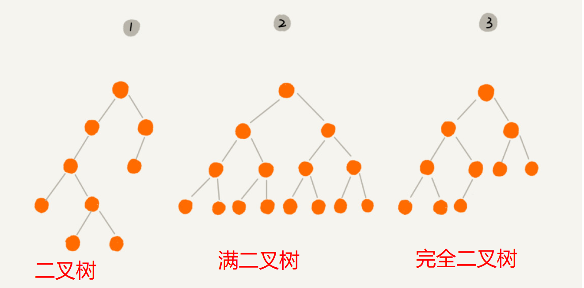
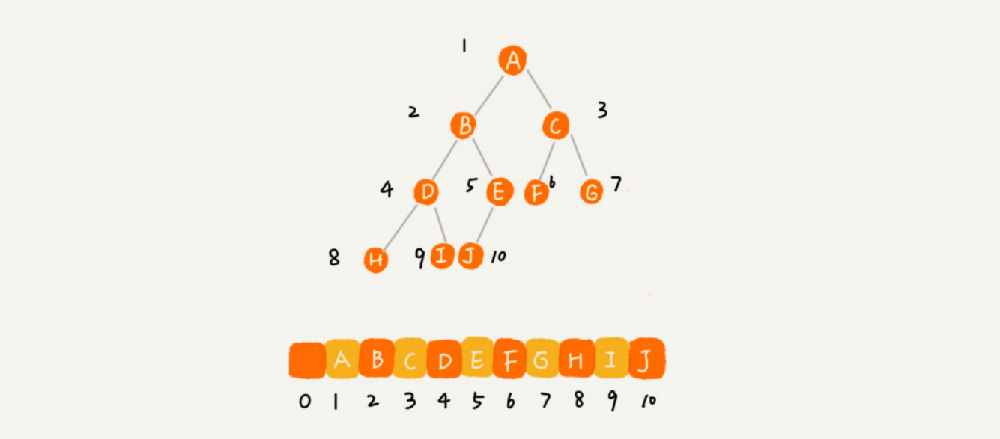
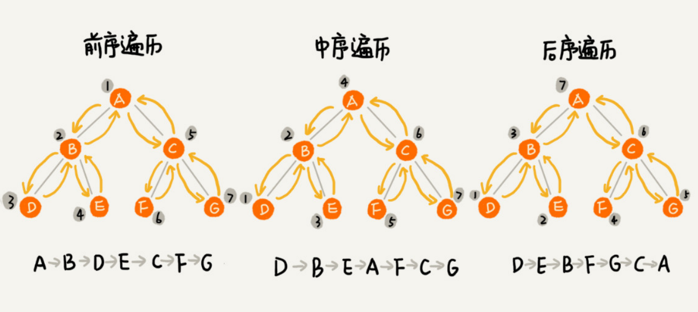

## 二叉树

#### 概念

- 根节点
- 叶子节点
- 父节点
- 子节点
- 兄弟节点
- 节点的高度 = 节点到叶子节点的最长路径（边数）
- 节点的深度 = 根节点到这个节点所经历的边的边数
- 节点的层数 = 节点的深度 + 1
- 树的高度 = 根节点的高度




- 二叉树：每个节点最多有两个子节点，分别是左子节点和右子节点
- 满二叉树：叶子节点全都在最底层，除了叶子节点之外，每个节点都有左右两个子节点的二叉树
- 完全二叉树：叶子节点都在最底下两层，最后一层的叶子节点都靠左排列，并且除了最后一层，其他层的节点个数都要达到最大的二叉树




#### 如何表示（或者存储）一棵二叉树？

一般有两种方法，一种是基于指针或者引用的二叉**链式存储法**，一种是基于数组的**顺序存储法**。

在链式存储法中，每个节点有三个字段，其中一个存储数据，另外两个是指向左右子节点的指针。只要获取到根节点，通过左右子节点的指针就可以访问到整棵树。

在顺序存储法中，如果节点 X 存储在数组中下标为 i 的位置，下标为 2 * i 的位置存储的就是左子节点，下标为 2 * i + 1 的位置存储的就是右子节点。反过来，下标为 i/2 的位置存储就是它的父节点。

如果某棵二叉树是一棵完全二叉树，那用数组存储无疑是最节省内存的一种方式，因为不需要另外存储左右子节点的指针，并且整个数组都能用满，不会浪费。




#### 二叉树的遍历

- 前序遍历：对于树中的任意节点来说，先打印**这个**节点，然后再打印它的**左**子树，最后打印它的**右**子树。
- 中序遍历：对于树中的任意节点来说，先打印它的**左**子树，然后再打印它**本身**，最后打印它的**右**子树。
- 后序遍历：对于树中的任意节点来说，先打印它的**左**子树，然后再打印它的**右**子树，最后打印**这个**节点本身。




#### 二叉树参考代码

```python
#!/usr/bin/python
# -*- coding: UTF-8 -*-
from queue import Queue
import math


class TreeNode:
    def __init__(self, val=None):
        self.val = val
        self.left = None
        self.right = None
        self.parent = None


class BinarySearchTree:
    def __init__(self, val_list=[]):
        self.root = None
        for n in val_list:
            self.insert(n)

    def insert(self, data):
        assert(isinstance(data, int))

        if not self.root:
            self.root = TreeNode(data)
        else:
            p, node = self.root, self.root
            while node:
                p = node
                if data < node.val:
                    node = node.left
                else:
                    node = node.right

            new_node = TreeNode(data)
            new_node.parent = p
            if data < p.val:
                p.left = new_node
            else:
                p.right = new_node

        return True

    def search(self, data):
        """
        搜索，返回bst中所有值为data的节点列表
        """
        assert(isinstance(data, int))

        res, node = [], self.root
        while node:
            if data < node.val:
                node = node.left
            else:
                if data == node.val:
                    res.append(node)
                node = node.right
        return res

    def delete(self, data):
        assert(isinstance(data, int))

        del_list = self.search(data)

        for node in del_list:
            if not node.parent and node != self.root:
                continue
            else:
                self._del(node)

    def _del(self, node):
        """
        删除节点node，有以下 3 种情况：
        1. 没有子节点，直接删除节点node的父节点指针
        2. 有一个子节点，将node的父节点指针指向node的子节点
        3. 有两个子节点：找到右子树的最小节点M，将值赋给N，然后删除M
        """
        # 情况1
        if not node.left and not node.right:
            if node == self.root:
                self.root = None
            else:
                if node.val < node.parent.val:
                    node.parent.left = None
                else:
                    node.parent.right = None
                node.parent = None
        # 情况2 - 只有右子节点
        elif not node.left and node.right:
            if node == self.root:
                self.root = node.right
                self.root.parent = None
                node.right = None
            else:
                if node.val < node.parent.val:
                    node.parent.left = node.right
                else:
                    node.parent.right = node.right
            node.right.parent = node.parent
            node.parent = None
            node.right = None
        # 情况2 - 只有左子节点
        elif node.left and not node.right:
            if node == self.root:
                self.root = node.left
                self.root.parent = None
                node.left = None
            else:
                if node.val < node.parent.val:
                    node.parent.left = node.left
                else:
                    node.parent.right = node.left
                node.left.parent = node.parent
                node.parent = None
                node.left = None
        # 情况3
        else:
            min_node = node.right
            # 找到右子树的最小值节点
            while min_node.left:
                min_node = min_node.left

            if node.val != min_node.val:
                node.val = min_node.val
                self._del(min_node)
            # 右子树的最小值节点与被删除节点的值相等，再次删除原节点
            else:
                self._del(min_node)
                self._del(node)

    def get_min(self):
        if not self.root:
            return None

        node = self.root
        while node.left:
            node = node.left

        return node.val

    def get_max(self):
        if not self.root:
            return None

        node = self.root
        while node.right:
            node = node.right

        return node.val

    def in_order(self):
        """
        中序遍历
        """
        if not self.root:
            return []
        return self._in_order(self.root)

    def _in_order(self, node):
        if not node:
            return []

        res = []
        res.extend(self._in_order(node.left))
        res.append(node.val)
        res.extend(self._in_order(node.right))
        return res

    def __repr__(self):
        # return str(self.in_order())
        # print(str(self.in_order()))
        return self._draw_tree()

    def _bfs(self):
        """
        bfs
        通过父子关系记录节点编号
        :return:
        """
        if self.root is None:
            return []

        ret = []
        q = Queue()
        # 队列[节点，编号]
        q.put((self.root, 1))

        while not q.empty():
            n = q.get()

            if n[0] is not None:
                ret.append((n[0].val, n[1]))
                q.put((n[0].left, n[1]*2))
                q.put((n[0].right, n[1]*2+1))

        return ret

    def _draw_tree(self):
        """
        可视化
        :return:
        """
        nodes = self._bfs()

        if not nodes:
            print('This tree has no nodes.')
            return

        layer_num = int(math.log(nodes[-1][1], 2)) + 1

        prt_nums = []

        for i in range(layer_num):
            prt_nums.append([None]*2**i)

        for v, p in nodes:
            row = int(math.log(p, 2))
            col = p % 2**row
            prt_nums[row][col] = v

        prt_str = ''
        for l in prt_nums:
            prt_str += str(l)[1:-1] + '\n'

        return prt_str


if __name__ == '__main__':
    nums = [4, 2, 5, 6, 1, 7, 3]
    bst = BinarySearchTree(nums)
    print("------------bst 1~7-----------------")
    print(bst)

    # 插入
    bst.insert(1)
    bst.insert(4)
    print("------------insert 1,4-----------------")
    print(bst)

    print("------------search 1-----------------")
    # 搜索
    for n in bst.search(1):
        print(n.val)

    # 删除
    bst.insert(6)
    bst.insert(7)
    print("------------insert  6,7-----------------")
    print(bst)
    bst.delete(7)
    print("------------delete 7-----------------")
    print(bst)
    bst.delete(6)
    print("------------delete 6-----------------")
    print(bst)
    bst.delete(4)
    print("------------delete 4-----------------")
    print(bst)

    # min max
    print("------------min max-----------------")
    print(bst.get_max())
    print(bst.get_min())
```


输出

```
------------bst 1~7-----------------
4
2, 5
1, 3, None, 6
None, None, None, None, None, None, None, 7

------------insert 1,4-----------------
4
2, 5
1, 3, 4, 6
None, 1, None, None, None, None, None, 7

------------search 1-----------------
1
1
------------insert  6,7-----------------
4
2, 5
1, 3, 4, 6
None, 1, None, None, None, None, None, 7
None, None, None, None, None, None, None, None, None, None, None, None, None, None, 6, 7

------------delete 7-----------------
4
2, 5
1, 3, 4, 6
None, 1, None, None, None, None, None, 6

------------delete 6-----------------
4
2, 5
1, 3, 4, None
None, 1, None, None, None, None, None, None

------------delete 4-----------------
5
2, None
1, 3, None, None
None, 1, None, None, None, None, None, None

------------min max-----------------
5
1
```


#### 递归遍历二叉树

```python
from typing import TypeVar, Generic, Generator, Optional
import random

T = TypeVar("T")

class TreeNode(Generic[T]):
    def __init__(self, value: T):
        self.val = value
        self.left = None
        self.right = None
    

# Pre-order traversal
def pre_order(root: Optional[TreeNode[T]]) -> Generator[T, None, None]:
    if root:
        yield root.val
        yield from pre_order(root.left)
        yield from pre_order(root.right)

# In-order traversal
def in_order(root: Optional[TreeNode[T]]) -> Generator[T, None, None]:
    if root:
        yield from in_order(root.left)
        yield root.val
        yield from in_order(root.right)

# Post-order traversal
def post_order(root: Optional[TreeNode[T]]) -> Generator[T, None, None]:
    if root:
        yield from post_order(root.left)
        yield from post_order(root.right)
        yield root.val


if __name__ == "__main__":
    num1 = TreeNode(1)
    num2 = TreeNode(2)
    num3 = TreeNode(3)
    num4 = TreeNode(4)
    num5 = TreeNode(5)
    num6 = TreeNode(6)
    num7 = TreeNode(7)


    num4.left, num4.right = num2, num5
    num2.left, num2.right = num1, num3
    num5.right = num6
    num6.right = num7

    
    print("--------前序遍历----------")
    print(list(pre_order(num4)))
    print("--------中序遍历----------")
    print(list(in_order(num4)))
    print("--------后序遍历----------")
    print(list(post_order(num4)))
```

输出

```
--------前序遍历----------
[4, 2, 1, 3, 5, 6, 7]
--------中序遍历----------
[1, 2, 3, 4, 5, 6, 7]
--------后序遍历----------
[1, 3, 2, 7, 6, 5, 4]
```

