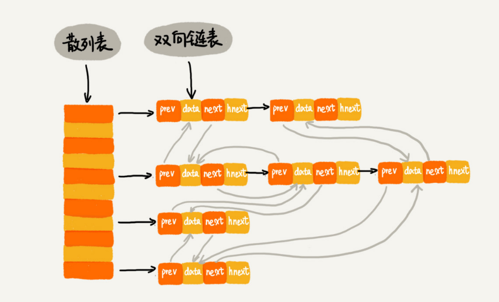

## LRU 缓存淘汰算法

一个缓存（cache）系统主要包含下面这几个操作：

- 往缓存中添加一个数据
- 从缓存中删除一个数据
- 在缓存中查找一个数据

如何实现一个高效的LRU缓存淘汰算法？最好让这三个操作的时间复杂度都为 O(1)？

可以将**散列表**和**链表**两种数据结构组合使用。



使用**双向链表**存储数据，链表中的每个结点处理存储数据（data）、前驱指针（prev）、后继指针（next）之外，还新增了一个特殊的字段 hnext，前驱和后继指针是为了将结点串在双向链表中，hnext 指针是为了将结点串在**散列表**的拉链中。


##### 如何查找一个数据？

通过散列表，我们可以很快地在缓存中找到一个数据，散列表中查找数据的时间复杂度接近O(1)。

##### 如何删除一个数据？

通过散列表找到数据所在结点，然后分别在双向链表和散列表的拉链中删除该结点，两者的时间复杂度都为 O(1) 

##### 如何添加一个数据？

需要先看这个数据是否已经在缓存中。如果已经在其中，需要将其移动到双向链表的尾部；如果不在其中，还要看缓存有没有满。如果满了，则将双向链表头部的结点删除，然后再将数据放到链表的尾部；如果没有满，就直接将数据放到链表的尾部。


#### 借助 Java 的 LinkedHashMap

按照访问时间排序的 LinkedHashMap 本身就是一个支持 LRU 缓存淘汰策略的缓存系统，它们两个的实现原理也是一模一样的。

```java
package com.whirly.cache;

import java.util.*;

public class LruLinkedMapCache<K, V> {

    private int cacheSize;

    private LinkedHashMap<K, V> mapCache;

    public LruLinkedMapCache(int cacheSize) {
        this.cacheSize = cacheSize;

        // 16 是初始大小，0.75 是装载因子，true 是表示按照访问时间排序
        this.mapCache = new LinkedHashMap(16, 0.75f, true) {
            @Override
            protected boolean removeEldestEntry(Map.Entry eldest) {
                // return super.removeEldestEntry(eldest);
                if (cacheSize + 1 == mapCache.size()) {
                    return true;
                } else {
                    return false;
                }
            }
        };
    }

    public void put(K key, V value) {
        mapCache.put(key, value);
    }

    public V get(K key) {
        return mapCache.get(key);
    }

    public Collection<Map.Entry<K, V>> getAll() {
        return new ArrayList<Map.Entry<K, V>>(mapCache.entrySet());
    }

    @Override
    public String toString() {
        StringBuilder builder = new StringBuilder();
        for (Map.Entry entry: getAll()) {
            builder.append(entry.getKey() + " : " + entry.getValue() + "\t");
        }
        return builder.toString();
    }
}
```

创建一个 cache 对象，设置 cache 的容量为3，然后往 cache 中添加4个数据，并访问2，观察 cache 的顺序变化

```java
package com.whirly.cache;

import org.junit.Test;

public class LruLinkedMapCacheTest {

    @Test
    public void test() {
        LruLinkedMapCache<Integer, Integer> cache = new LruLinkedMapCache<>(3);
        cache.put(1, 1);
        cache.put(2, 2);
        cache.put(3, 3);
        System.out.println(cache.toString());

        cache.put(4, 4);
        System.out.println(cache.toString());

        cache.get(2);
        System.out.println(cache.toString());
    }
}
```

在添加数据4的时候，由于 cache 的容量已满，所以最近最少使用的数据1被删除，此时数据2成为新的最近最少使用的数据；访问数据2，数据3成为新的最近最少使用的数据。

```
1 : 1	2 : 2	3 : 3	
2 : 2	3 : 3	4 : 4	
3 : 3	4 : 4	2 : 2	
```

