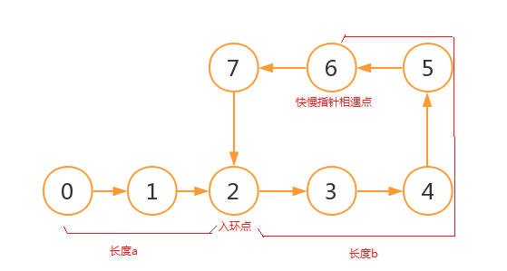

#### [环形链表 II](https://leetcode-cn.com/problems/linked-list-cycle-ii/)

给定一个链表，返回链表开始入环的第一个节点。 如果链表无环，则返回 `null`。

为了表示给定链表中的环，我们使用整数 `pos` 来表示链表尾连接到链表中的位置（索引从 0 开始）。 如果 `pos` 是 `-1`，则在该链表中没有环。

**说明：**不允许修改给定的链表。

 

**示例 1：**

```
输入：head = [3,2,0,-4], pos = 1
输出：tail connects to node index 1
解释：链表中有一个环，其尾部连接到第二个节点。
```


**示例 2：**

```
输入：head = [1,2], pos = 0
输出：tail connects to node index 0
解释：链表中有一个环，其尾部连接到第一个节点。
```


**示例 3：**

```
输入：head = [1], pos = -1
输出：no cycle
解释：链表中没有环。
```


 

**进阶：**
你是否可以不用额外空间解决此题？

#### 思路

首先通过快慢指针判断是否有环，无环则返回 None，有环一定可以相遇，则继续。



设起点到入环点的长度为 a，入环点到快慢指针相遇点的长度为b，那么此时慢指针走了 a + b，那么快指针已经走了 2 * (a + b)，所以慢指针再走 a + b 会再次回到当前的相遇点，如果只再走 (a + b) - b = a，就会到达入环点；

当慢指针继续往前走 a 的同时另一个指针从起点开始也走 a，那么这两个指针将在入环点相遇

```python
# Definition for singly-linked list.
# class ListNode(object):
#     def __init__(self, x):
#         self.val = x
#         self.next = None

class Solution(object):
    def detectCycle(self, head):
        """
        :type head: ListNode
        :rtype: ListNode
        """
        slow, fast = head, head
        hasCycle = False
        while fast and fast.next:
            slow, fast = slow.next, fast.next.next
            if slow == fast:
                hasCycle = True
                break
                
        if not hasCycle:
            return None
        while slow != head:
            slow, head = slow.next, head.next
        return head
```

