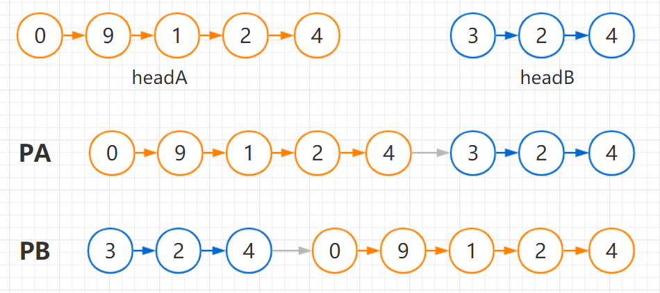

# 找出两个链表的交点

题目：

<https://leetcode-cn.com/problems/intersection-of-two-linked-lists/>

编写一个程序，找到两个单链表相交的起始节点。

如下面的两个链表**：**

[](https://assets.leetcode-cn.com/aliyun-lc-upload/uploads/2018/12/14/160_statement.png)

在节点 c1 开始相交。

**注意：**

- 如果两个链表没有交点，返回 `null`.
- 在返回结果后，两个链表仍须保持原有的结构。
- 可假定整个链表结构中没有循环。
- 程序尽量满足 O(*n*) 时间复杂度，且仅用 O(*1*) 内存。


解法：

<https://blog.csdn.net/fengxinlinux/article/details/78885764>

1.暴力解法。 
从头开始遍历第一个链表，遍历第一个链表的每个节点时，同时从头到尾遍历第二个链表，看是否有相同的节点，第一次找到相同的节点即第一个交点。若第一个链表遍历结束后，还未找到相同的节点，即不存在交点。时间复杂度为O(n^2)。这种方法显然不是写这篇博客的重点。。。不多说了。

2.使用栈。 
我们可以从头遍历两个链表。创建两个栈，第一个栈存储第一个链表的节点，第二个栈存储第二个链表的节点。每遍历到一个节点时，就将该节点入栈。两个链表都入栈结束后。则通过top判断栈顶的节点是否相等即可判断两个单链表是否相交。因为我们知道，若两个链表相交，则从第一个相交节点开始，后面的节点都相交。 
若两链表相交，则循环出栈，直到遇到两个出栈的节点不相同，则这个节点的后一个节点就是第一个相交的节点。


这个方法在没有要求空间复杂度的时候，使用栈来解决这个问题也是挺简便的。

3.遍历链表记录长度。 
同时遍历两个链表到尾部，同时记录两个链表的长度。若两个链表最后的一个节点相同，则两个链表相交。 
有两个链表的长度后，我们就可以知道哪个链表长，设较长的链表长度为len1,短的链表长度为len2。 
则先让较长的链表向后移动(len1-len2)个长度。然后开始从当前位置同时遍历两个链表，当遍历到的链表的节点相同时，则这个节点就是第一个相交的节点。


如果只是判断是否存在交点，那么就是另一个问题，即 [编程之美 3.6](https://github.com/CyC2018/CS-Notes/blob/master/docs/notes) 的问题。有两种解法：

- 把第一个链表的结尾连接到第二个链表的开头，看第二个链表是否存在环；
- 或者直接比较两个链表的最后一个节点是否相同。


```python
# Definition for singly-linked list.
# class ListNode(object):
#     def __init__(self, x):
#         self.val = x
#         self.next = None

class Solution(object):
    def getIntersectionNode(self, headA, headB):
        """
        :type head1, head1: ListNode
        :rtype: ListNode
        """
        if headA == None or headB == None:
            return
        lenA = 0
        tempA = headA
        while tempA:
            lenA += 1
            tempA = tempA.next
            
        lenB = 0
        tempB = headB
        while tempB:
            lenB += 1
            tempB = tempB.next
        
        pA, pB = headA, headB
        if lenA > lenB:
            i = lenA - lenB
            while i>0:
                pA = pA.next
                i -= 1
        else:
            i = lenB - lenA
            while i>0:
                pB = pB.next
                i -= 1
        
        while pA:
            if pA == pB:
                return pA
            else:
                pA = pA.next
                pB = pB.next
        
        return None
    
```


执行用时 : 272 ms, 在Intersection of Two Linked Lists的Python提交中击败了44.12% 的用户

内存消耗 : 41.7 MB, 在Intersection of Two Linked Lists的Python提交中击败了100.00% 的用户


另一种更简洁的解法

设 A 的长度为 a + c，B 的长度为 b + c，其中 c 为尾部公共部分长度，可知 a + c + b = b + c + a。

当访问 A 链表的指针访问到链表尾部时，令它从链表 B 的头部开始访问链表 B；同样地，当访问 B 链表的指针访问到链表尾部时，令它从链表 A 的头部开始访问链表 A。这样就能控制访问 A 和 B 两个链表的指针能同时访问到交点。




headA + headB  与 headB + headA 的长度是相同的，所以如果 headA 与 headB 有交点，那么在遍历结束之前一定能遇到 PA == PB，如果没有交点，PA 和 PB 将同时到达尾部，也就是 PA = null 并且 PB = null，此时 pA == pB 为 True


```python
# Definition for singly-linked list.
# class ListNode(object):
#     def __init__(self, x):
#         self.val = x
#         self.next = None

class Solution(object):
    def getIntersectionNode(self, headA, headB):
        """
        :type head1, head1: ListNode
        :rtype: ListNode
        """
        pA = headA
        pB = headB
        
        while pA != pB:
            pA = headB if pA == None else pA.next
            pB = headA if pB == None else pB.next
        
        return pA
```


执行用时 : 312 ms, 在Intersection of Two Linked Lists的Python提交中击败了13.24% 的用户

内存消耗 : 41.7 MB, 在Intersection of Two Linked Lists的Python提交中击败了100.00% 的用户